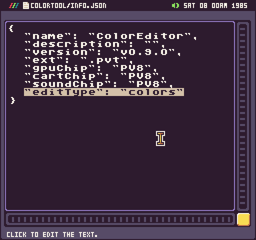
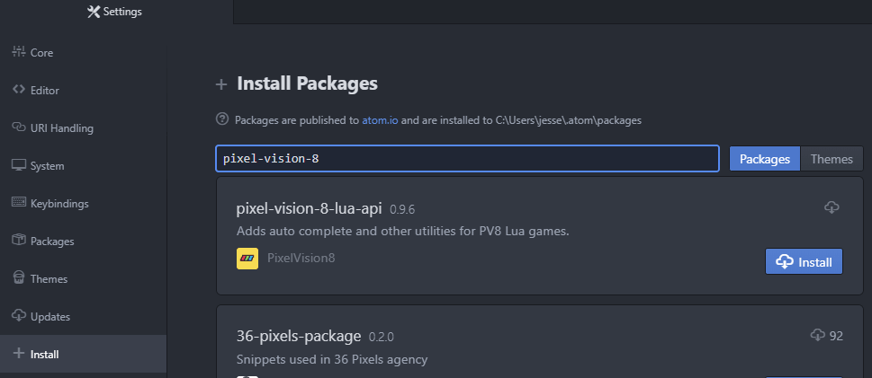
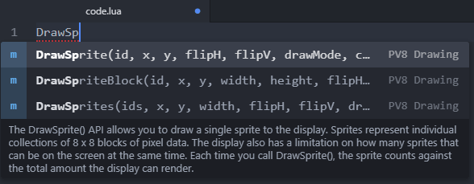
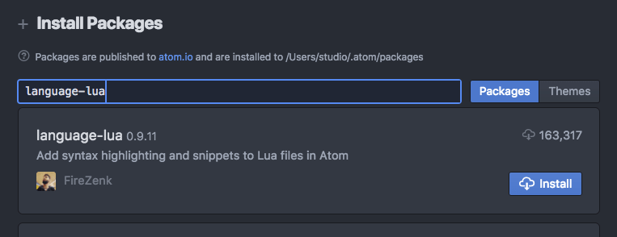
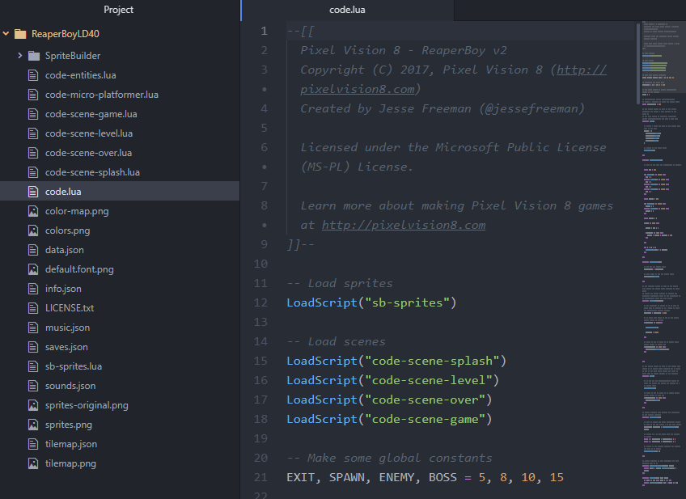

# Tools

Pixel Vision 8 games are designed to run on top of Pixel Vision SDK. This open source SDK is written in C# but also supports Lua for making games. While you could easily build PV8 games natively, the Pixel Vision 8 and Pixel Vision OS streamlines this process. It also provides a standard file format, loading mechanism, and asset pipeline.

Understanding how to code PV8 games in Lua allows you to create games from scratch and share them with others.

## Tools

Pixel Vision OS includes built-in tools to help you create PV8 games. Each tool is registered to edit a specific Pixel Vision 8 file type. For example, if you open up the Color Tool’s info.json file, you’ll see it is set to edit color files.

Pixel Vision OS includes the following built-in tools:

| Tool             | Edit Type            | File                                   |
|------------------|----------------------|----------------------------------------|
| Color Tool       | colors               | colors\.png                            |
| Image Preview    | png                  | \*\.png                                |
| Installer Tool   | installer            | installer\.txt                         |
| Music Tool       | music                | music\.json                            |
| Settings Tool    | settings             | n/a                                    |
| SFX Tool         | sounds               | sounds\.json                           |
| Sprite Tool      | sprites              | sprites\.png                           |
| Text Editor Tool | txt, json, info, lua | \*\.txt, \*\.json, info\.json, \*\.lua |
| Tilemap Tool     | tilemap, tiles       | tilemap\.json, tilemap\.png            |
| Workspace Tool   | workspace            | n/a                                    |

In addition to the built-in tools, you can also build your own. If a PV8 game is located in a `/Workspace/System/Tools/` folder, Pixel Vision OS will attempt to register it with the file type it is associated with in the `info.json` file. 

That means you can create or modify any of the built-in tools for your own specific needs. You can even have `System `folders on disks and they will load on top of the Workspace drive if you want to run your tools from disks and not install them over the built-in ones.

## External Editors

Pixel Vision 8 is an open system. In addition to the built-in tools, you can also use any external editor to directly modify the files in your workspace.

### Atom

While Pixel Vision OS’s built-in text editor is good for simple coding, the ideal way to make PV8 games is with an external code editor. Atom ([https://atom.io](https://atom.io)) is a great, lightweight code editor that works perfectly with Pixel Vision 8 external tool workflow. Before you open your game’s Lua files in Atom, you will want to add a few packages. 

The first package to install is Pixel Vision 8’s own API autocomplete. You do this by going to Atom’s settings, then select the install tab. From there type in `pixel-vision-8` and search for the package.

Once installed, you will be able to get PV8 code completion in any `.lua` file you work on in the editor.

Just start typing out the first few letters of an API and the autocomplete drop-down will give you the options to choose from. Each listing has a detailed description of what the API does and offers an autocomplete template allowing you to tab through each of the parameters once you add the code snippet to your project.

Another advantage of installing the PV8 Atom package is that you can keep it up to date with each release. This allows you to have the latest API autocomplete definitions without having to dig through the documentation to see the latest changes.

You will also want to install a good Lua package if you have not done so already. I use `language-lua` by FireZenk.

Once you have everything set up, you can open any PV8 disk or project folder with Atom. You’ll see the entire file structure of the project and can begin making changes to any of the Lua or JSON files.

When you make changes to your code in Atom, simply press `CTRL + 4` in Pixel Vision 8 to reload the game.