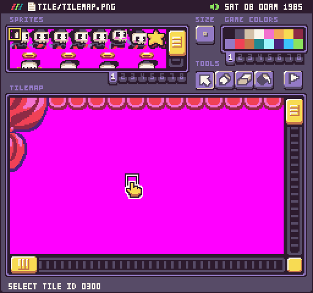
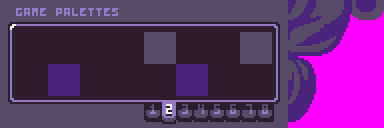
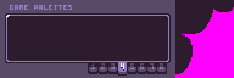

The `UpdateTiles()` API allows you to update the color offset and flag values of multiple tiles at once. Simply supply an array of tile IDs and the new tile’s color offset and a flag value. This helper method uses the `Tile()` API under the hood to update each tile, so any changes to a tile’s color offset will automatically force it to be redrawn to the tilemap cache layer. Use this when you don’t need to make changes to each tile’s sprite ID and don’t want to manually iterate over large collections of tiles manually.

## Usage

```csharp
UpdateTiles ( ids, column, row, width, colorOffset, flag )
```

## Arguments

| Name        | Value   | Description                                                                                 |
|-------------|---------|---------------------------------------------------------------------------------------------|
| ids         | int\[\] | An array of sprite IDs to use for each tile being updated\.                                 |
| column      | int     | Start column of the first tile to update\. The 0 column is on the far left of the tilemap\. |
| row         | int     | Start row of the first tile to update\. The 0 row is on the top of the tilemap\.            |
| colorOffset | int     | An optional color offset int value to be applied to each updated tile\.                     |
| flag        | int     | An optional flag int value to be applied to each updated tile\.                             |

## Example

In this example, we are going to read all of the tiles and see which ones have sprites assigned to them. We’ll be using the following Tilemap:



Next, we’ll set up 4 palettes to apply to each of these tiles:







Finally, we’ll change each tile’s `colorOffset` value over several frames to give the impression that the background is fading up and down:


## Lua

```lua
  -- Set up a time and delay
  local time = 0
  local delay = 800

  -- This will be the direction value for the transition
  local dir = 1

  -- Total number of palettes for transition
  local max = 3

  -- Current palette ID
  local paletteID = 0

  -- Loop through all of the tiles and find the ones that have sprites
  local mapSize = TilemapSize()
  local totalTiles = mapSize.x * mapSize.y

  -- Store all of the tiles that should be updated
  local tileIDs = {}

  function Init()

    -- Loop through all of the tiles in the tilemap
    for i = 1, totalTiles do

      -- The index is offset by 1 since the first tile starts at 0
      local index = (i - 1)

      -- Convert the loop index to a column,row position
      local pos = CalculatePosition(index, mapSize.x)

      -- Check to see if the tile has a sprite
      if(Tile(pos.x, pos.y).spriteID &gt; - 1) then

        -- Save the tile index value
        table.insert(tileIDs, index)

      end
    end

	end
    
    function Update(timeDelta)
    
      -- Increase the time on each frame and test if it is greater than the delay
      time = time + timeDelta
      if(time &gt; delay) then
    
        -- Update the palette ID based on the direction
        paletteID = paletteID + dir
    
        -- Test if the palette ID is too small or too large and reverse the direction
        if(paletteID &gt;= max) then
          dir = -1
        elseif(paletteID &lt;= 0) then
          dir = 1
        end
    
        -- Reset the time value
        time = 0
    
        -- Update each tile's color offset
        UpdateTiles(tileIDs, PaletteOffset(paletteID))
    
      end
    end
    
    function Draw()
    
      -- Redraw the display
      RedrawDisplay()
    
      -- Draw the text for the palette and color ID
      DrawText("Palette " .. paletteID, 32, 16, DrawMode.Sprite, "large", 15)
    
    end
```


## C#

```csharp

    class UpdateTilesExample : GameChip
    {
        // Set up a time and delay
        private int time;
        private int delay = 800;
    
        // This will be the direction value for the transition
        private int dir = 1;
    
        // Total number of palettes for transition
        private int max = 3;
    
        // Current palette ID
        private int paletteID;
    
        // Store the tilemap dimensions
        private Point mapSize;
        private int totalTiles;
    
        // Store all of the tiles that should be updated
        int[] tileIDs;
    
        public override void Init()
        {
    
            // Set the tilemap dimensions
            mapSize = TilemapSize();
            totalTiles = mapSize.X * mapSize.Y;
    
            // We'll use a list to store tile IDs
            var tileList = new List&lt;int&gt;();
    
            // Loop through all of the tiles in the tilemap
            for (int i = 0; i &lt; totalTiles; i++)
            {
           
                // Convert the loop index to a column,row position
                var pos = CalculatePosition(i, mapSize.X);
    
                // Check to see if the tile has a sprite
                if (Tile(pos.X, pos.Y).spriteID &gt; -1)
                {
                    tileList.Add(i);
    
                }
            }
    
            // Convert the tileList into an array
            tileIDs = tileList.ToArray();
        }
    
        public override void Update(int timeDelta)
        {
            // Increase the time on each frame and test if it is greater than the delay
            time = time + timeDelta;
    
            if (time &gt; delay)
            {
    
                // Update the palette ID based on the direction
                paletteID += dir;
    
                // Test if the palette ID is too small or too large and reverse the direction
                if (paletteID &gt;= max)
                {
                    dir = -1;
                }
                else if (paletteID &lt;= 0)
                {
                    dir = 1;
                }
    
                // Reset the time value
                time = 0;
    
                // Update each tile's color offset
                UpdateTiles(tileIDs, PaletteOffset(paletteID));
            }
        }
    
        public override void Draw()
        {
            // Redraw the display
            RedrawDisplay();
    
            // Draw the text for the palette and color ID
            DrawText("Palette " + paletteID, 32, 16, DrawMode.Sprite, "large", 15);
    
        }
    }
```


One thing to note is that while this demo shows how to modify individual tiles at run-time, it’s important to point out that this approach may have bad performance impacts. If you need to modify large groups of tiles, try indexing them in the tilemap during startup and only iterate over tiles you know you need to update.

Running this code will output the following:


